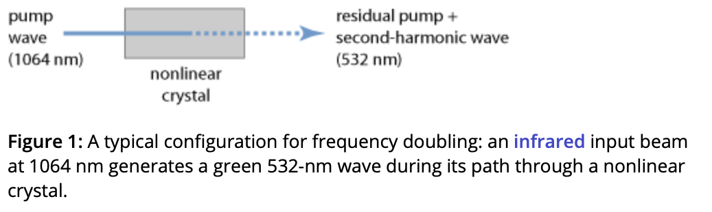

**Folder containing read and useful papers**

Waveguides: https://www.rp-photonics.com/waveguides.html

Second-harmonic generation: 

    - Wikipedia page: https://en.wikipedia.org/wiki/Second-harmonic_generation 

    - Topic paper collection: https://www.sciencedirect.com/topics/chemistry/second-harmonic-generation 

    - Frequency Doubling by Photonic Encyclopedia: https://www.rp-photonics.com/frequency_doubling.html
    

Nonlinear Crystal Materials: https://www.rp-photonics.com/nonlinear_crystal_materials.html 

Propagation Constant:
    - Photonic encyclopedia: https://www.rp-photonics.com/propagation_constant.html#:~:text=The%20propagation%20constant%20of%20a,the%20light%20field%20at%20position%20 

    - Wikepedia page: https://en.wikipedia.org/wiki/Propagation_constant#:~:text=The%20propagation%20constant%20itself%20measures,one%20port%20to%20the%20next.

